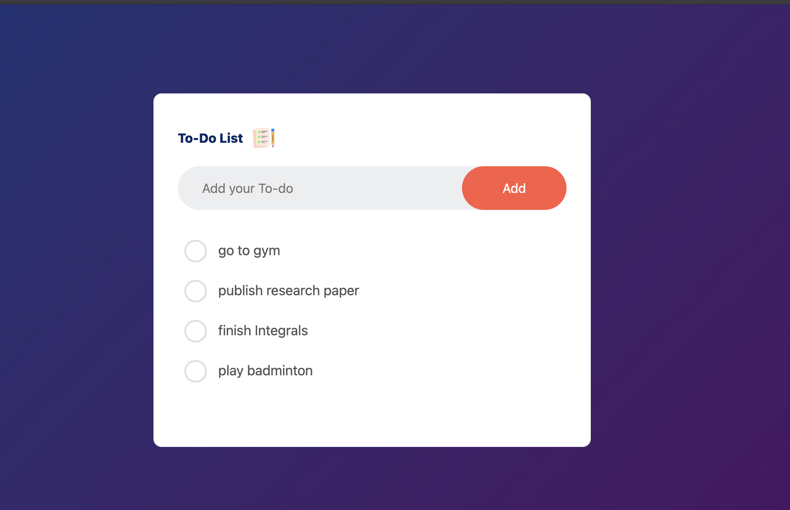

# ✅ Todo List App  

A simple and responsive **Todo List App** built with **React**, **Tailwind CSS**, and optionally integrated to display tasks.  

## 🚀 Features  
- ➕ Add, edit, and delete tasks  
- ✅ Mark tasks as completed  
- 📑 Filter tasks (e.g., all, completed, pending)  
- 🎨 Modern and responsive UI with Tailwind CSS  
- 🌦️ Optional weather display using Weather API  

## 🛠️ Technologies Used  
- **React**: For building dynamic user interfaces  
- **Tailwind CSS**: For responsive and customizable styling  
- **Weather API** (Optional): Display current weather information  

## 📦 Installation  

1. **Clone the repository:**  
```bash  
git clone https://github.com/kushvendar/To_do  
cd todo-list-app  
```  

2. **Install dependencies:**  
```bash  
npm install  
``` 

3. **Start the development server:**  
```bash  
npm run dev 
```  

4. **Build for production:**  
```bash  
npm run build  
```  

## 📸 Screenshots  

  

## 📂 Project Structure  

```  
todo-list-app/  
├── public/  
├── src/  
│   ├── components/   # Reusable components (e.g., TodoItem, WeatherWidget)  
│   ├── images/       # Images and icons  
│   ├── App.jsx        # Main app component  
│   ├── App.css    # Tailwind CSS styles  
│   └── ...   
├── package.json  
└── README.md  
```  

## 💡 Usage  

- **Add Task:** Type in the input field and press "Add"  
- **Edit Task:** Click the edit icon next to the task  
- **Delete Task:** Click the circular icon to mark compelete
- **Filter Tasks:** Use the filter options to view all, completed, or pending tasks 


---